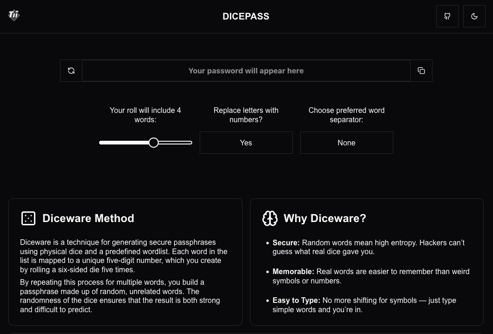

# 🎲 DicePass

**DicePass** is a simple, beautiful tool for generating secure Diceware-style passphrases. Built with **Next.js**, it helps you create memorable, high-entropy passwords using real words — no weird symbols, no hassle.



---

## ✨ Features

- 🎲 Random, dice-based word generation
- 🔐 Strong passphrases that are easy to remember
- 🧠 Human-friendly interface
- 📱 Mobile responsive
- 🌙 Dark mode support
- 🌍 Open source and customizable

---

## 💡 What is Diceware?

Diceware is a method for creating strong passwords using dice and a predefined wordlist. Each word is selected based on real dice rolls, ensuring true randomness and high security. Instead of using symbols and numbers, you get real, memorable words like:

> `planet velvet hammer fox glide`

Learn more in the [Diceware section](https://en.wikipedia.org/wiki/Diceware) on Wikipedia.

---

## 🚀 About DicePass

**DicePass** was created to make Diceware password generation fast, simple, and pleasant. Built with **Next.js**, it focuses on clarity, usability, and clean design. You choose how many words you want, hit generate, and you’re done.

The wordlists are sourced from trusted projects to ensure both randomness and readability.

Want to adapt or improve it? The code is open and available — just hit the button in the top-right to visit the repo.

---

## 🛠 Tech Stack

- [Next.js](https://nextjs.org/)
- [TypeScript](https://www.typescriptlang.org/)
- [SCSS Modules](https://sass-lang.com/)
- Lightweight, no backend

---

## 📦 Getting Started

```bash
git clone https://github.com/takiido/dicepass
cd dicepass
npm install
npm run dev
