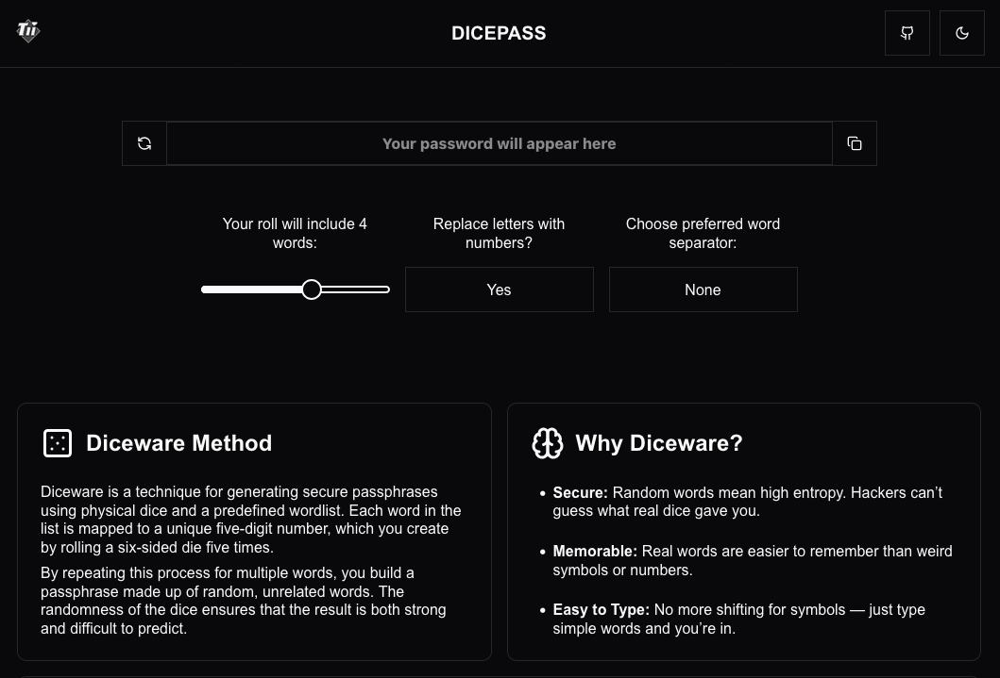

# 🎲 DicePass

**DicePass** is a simple, beautiful tool for generating secure Diceware-style passphrases. Built with **Next.js**, it helps me create memorable passwords using real words.



---

## ✨ Features

- Random, dice-based word generation
- Strong passphrases that are easy to remember
- Human-friendly interface
- Mobile responsive
- Kanye West picture hidden somwhere

---

## 💡 What is Diceware?

Diceware is a method for creating strong passwords using dice and a predefined wordlist. Each word is selected based on real dice rolls, ensuring true randomness and high security. Instead of using symbols and numbers, you get real, memorable words like:

> `planet velvet hammer fox glide`

Learn more in the [Diceware section](https://en.wikipedia.org/wiki/Diceware) on Wikipedia.

---

## 🛠 Tech Stack

- [Next.js](https://nextjs.org/)
- [TypeScript](https://www.typescriptlang.org/)
- [SCSS Modules](https://sass-lang.com/)
- Lightweight, no backend

---

## 📦 Getting Started

```bash
git clone https://github.com/takiido/dicepass
cd dicepass
npm install
npm run dev
